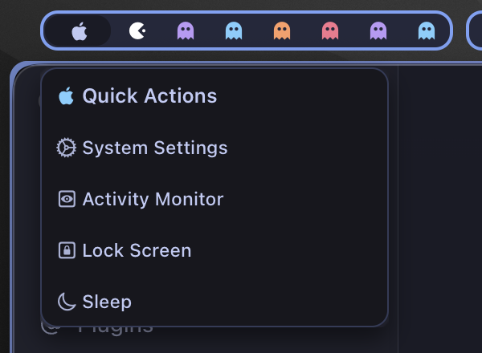
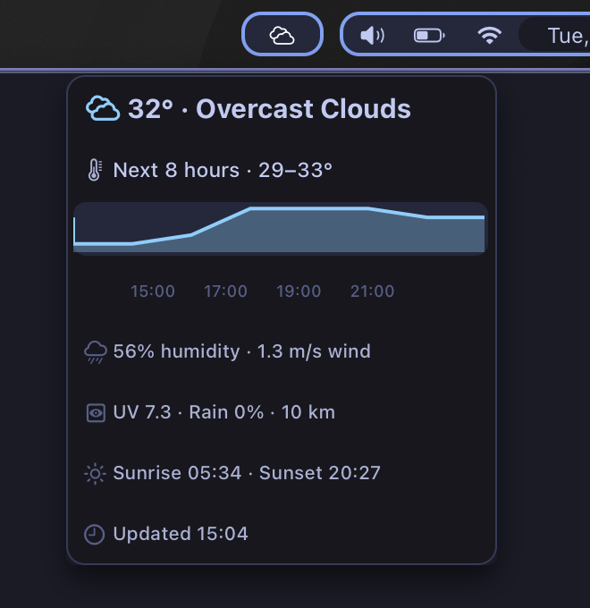

<p align="center">
  
</p>

<p align="center">
  <strong>A focused Tokyo Night workspace for macOS.</strong><br>
  SketchyBar, yabai, JankyBorders, skhd, kitty and Powerlevel10k—designed as one system.
</p>

<p align="center">
  <a href="https://github.com/FelixKratz/SketchyBar"></a>
  <a href="https://github.com/koekeishiya/yabai"></a>
  <a href="https://github.com/koekeishiya/skhd"></a>
  <a href="https://github.com/FelixKratz/JankyBorders"></a>
  <a href="https://github.com/kovidgoyal/kitty"></a>
</p>

## Preview

<p align="center">
  
</p>

The active space becomes a white Pac-Man while the remaining spaces form an evenly spaced, color-coded ghost track. Switching spaces animates Pac-Man across the track and settles with a short bounce.

<p align="center">
  
</p>

### Contextual popups

<table>
  <tr>
    <td width="46%" align="center" valign="top">
      <br>
      <sub>Focused system actions with consistent icon and row spacing.</sub>
    </td>
    <td width="54%" align="center" valign="top">
      <br>
      <sub>Live conditions, an animated eight-hour chart and useful forecast metrics.</sub>
    </td>
  </tr>
</table>

## What is included

| Component | Configuration |
| --- | --- |
| SketchyBar | Animated spaces, context-aware app details, subtle hover states and compact shadcn-inspired popups |
| yabai | BSP tiling, 12 px gaps, fast `ease_out_expo` transitions and coordinated window opacity |
| JankyBorders | Rounded, HiDPI Tokyo Night gradient borders rendered above windows |
| skhd | Keyboard-driven window and space navigation |
| kitty | Tokyo Night Storm palette, restrained transparency, matching tabs and MesloLGS NF typography |
| Powerlevel10k | Compact powerline prompt aligned with the same blue, cyan, orange and muted surfaces |
| Neovim | Lua configuration with LSP, Telescope, Treesitter, debugging and Git integrations |

### SketchyBar details

- App-aware context text for kitty, Codex, Spotify, Mail and Arc.
- Professional Apple, Wi-Fi, battery, time, volume and weather cards.
- Wi-Fi details include SSID, security, local IP and router.
- Battery details include remaining time, condition, maximum capacity and cycle count.
- Weather includes temperature range, humidity, wind, UV, precipitation, visibility and sunrise/sunset.
- Subtle hover and toggle animations use the shared Tokyo Night palette.

## Installation

> Review the files before copying them. These are personal defaults and include opinionated yabai rules and keyboard shortcuts.

Install the applications and command-line dependencies linked above, plus [`jq`](https://jqlang.github.io/jq/), [SF Pro](https://developer.apple.com/fonts/) and [MesloLGS NF](https://github.com/romkatv/powerlevel10k#fonts). yabai users should also complete the official scripting-addition setup for their macOS version.

Clone the repository and copy the configurations you want:

```bash
git clone https://github.com/mvritz/dotfiles.git
cd dotfiles

mkdir -p ~/.config/{sketchybar,yabai,skhd,borders,kitty}
cp -R sketchybar/. ~/.config/sketchybar/
cp -R yabai/. ~/.config/yabai/
cp -R skhd/. ~/.config/skhd/
cp -R borders/. ~/.config/borders/
cp -R kitty/. ~/.config/kitty/
cp .p10k.zsh ~/.p10k.zsh
```

Make sure Powerlevel10k is installed and sourced by your shell, then load this configuration from `~/.zshrc`:

```zsh
[[ -f ~/.p10k.zsh ]] && source ~/.p10k.zsh
```

### Weather and spaces

Edit [`sketchybar/environment.sh`](sketchybar/environment.sh) after copying it:

- Replace the placeholder `WEATHER_API_KEY` with an [OpenWeatherMap](https://openweathermap.org/api) API key.
- Install the linked `Get Location` shortcut from [`sketchybar/required.txt`](sketchybar/required.txt), or adjust the location logic in `weather.sh`.
- Match `SPACES` and `SPACE_GHOSTS` to the spaces available on your machine.
- Adjust `APPS` and `APP_SPACES` if you use the optional app-sorting action.

Finally, restart the services:

```bash
sketchybar --reload
yabai --restart-service
skhd --restart-service
```
