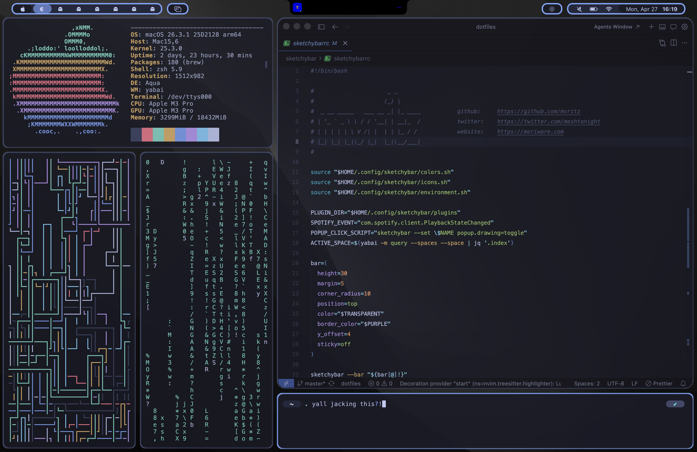
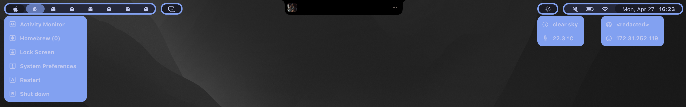

<p align="center">
  
</p>
<p align="center">
  <b>beautiful & efficient mac setup</b>
</p>
<p align="center">
  <a href="https://github.com/FelixKratz/SketchyBar">
    
  </a>
  <a href="https://github.com/kovidgoyal/kitty">
    
  </a>
  <a href="https://github.com/koekeishiya/yabai">
    
  </a>
  
</p>

# Dotfiles

## Preview

<p align="center">
  
</p>

This setup uses [kitty](https://github.com/kovidgoyal/kitty), [yabai](https://github.com/koekeishiya/yabai) with [JankyBorders](https://github.com/FelixKratz/JankyBorders), and [SketchyBar](https://github.com/FelixKratz/SketchyBar). The menu bar and notch are rounded out with [NotchNook](https://lo.cafe/notchnook).

## SketchyBar

<p align="center">
  
  
</p>

### Installation

Install the dependencies:

- [SketchyBar](https://github.com/FelixKratz/SketchyBar)
- [yabai](https://github.com/koekeishiya/yabai) (for space and window-related features)
- [jq](https://jqlang.github.io/jq/) (`brew install jq`)
- [Location extension (Shortcuts)](https://www.icloud.com/shortcuts/faa5f880cf19481984e9cef20c225a58) (weather uses `shortcuts run "Get Location"`; add this to Shortcuts and name it `Get Location` on your Mac)
- [SF Pro](https://developer.apple.com/fonts/)
- [Nerd Fonts](https://www.nerdfonts.com/font-downloads)
- An [OpenWeatherMap](https://openweathermap.org/api) API key (One Call API 3.0)

Copy the config:

```bash
git clone https://github.com/mvritz/dotfiles.git &&
cp -r dotfiles/sketchybar ~/.config/sketchybar
```

After installing the location extension, edit [`environment.sh`](sketchybar/environment.sh) in `~/.config/sketchybar`, set your variables there (`WEATHER_API_KEY`, `SPACES`, `SPACE_GHOSTS`, `APPS`, `APP_SPACES`).
