<p align="center">
  
</p>
<p align="center">
  <b>The most efficient and most beautiful mac setup.</b>
</p>
<p align="center">
  <a href="https://github.com/FelixKratz/SketchyBar">
    
  </a>
  <a href="/github.com/koekeishiya/yabai">
    
  </a>
  <a href="/github.com/koekeishiya/skhd">
    
  </a>
  
</p>

# Dotfiles

## Setup

<p align="center">
  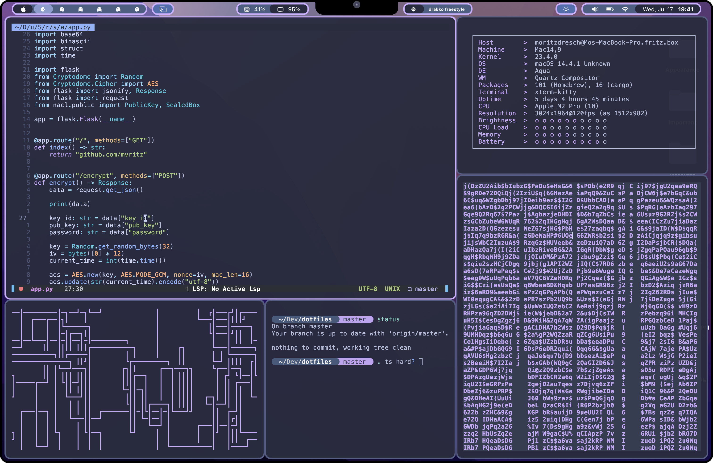
</p>

- [Sketchybar](#sketchybar)
    - [Installation and Setup](#installation-and-setup)
    - [Features](#features)
- [Yabai](#yabai)
- [Skhd](#skhd)
- [Misc](#misc)
    - [Browser](#browser)
    - [Spicetify](#spicetify)

## Sketchybar

<p align="center">
  
  
</p>

### Installation and Setup

To run all the features of Sketchybar you need to install the following dependencies:

- [yabai](https://github.com/koekeishiya/yabai)
- [jq](https://jqlang.github.io/jq/) (`brew install jq`)
- [This shortcut](https://www.icloud.com/shortcuts/faa5f880cf19481984e9cef20c225a58)
- [SF Pro](https://developer.apple.com/fonts/)
- [Nerd Fonts](https://www.nerdfonts.com/font-downloads)

Use this sketchybar configuration by running the following commands:

```bash
git clone https://github.com/mvritz/dotfiles.git &&
cp -r dotfiles/sketchybar ~/.config/sketchybar
```

You also need to make create an API Key for the [OpenWeatherMap API](https://openweathermap.org/api). After that you
need to edit the [environment.sh](sketchybar/environment.sh) file in the sketchybar folder. You need to replace
the `WEATHER_API_KEY` with your own API Key. You can also customize the [spaces and app sorting](#spaces) in
there.

### Features

#### Apple Icon

<p style="display: flex; align-items: start; border: 2px solid; border-radius: 5px; padding: 6px; background-color: #3C589F">
  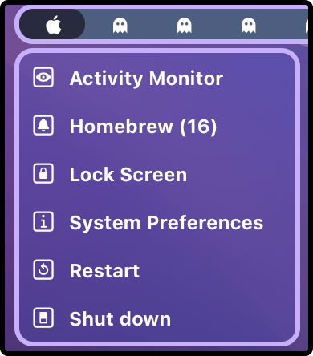
  The Apple Icon in the top right corner of the screen has popup with the options to open the activity monitor, update homebrew, 
  lock the screeen, open system preferences, restart, and to shut down the computer.
</p>

#### Spaces

<div style="display: flex; flex-direction: column; align-items: center; border: 2px solid; border-radius: 5px; padding: 6px; background-color: #3C589F">
  <div style="display: flex; flex-direction: column; gap: 4px; margin-bottom: 15px">
    
    
    
  </div>
  <div style="display: flex; flex-direction: row; width: 100%; align-items: start">
    Your spaces are displayed right next to the apple icon. Every space has a different icon which is displayed right next to the ghosts. You can customize the 
    spaces and the apps that are displayed in the spaces in the environment.sh file. It works like this: You define a space an a list of apps
    that are in that space. Whe you click on the icon for the current space, all the apps will be sorted into their corresponding spaces.
  </div>
</div>

#### RAM and CPU

<div style="display: flex; flex-direction: column; align-items: center; border: 2px solid; border-radius: 5px; padding: 6px; background-color: #3C589F">
  <div style="display: flex; flex-direction: column; margin-bottom: 15px; margin-top: 15px">
    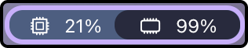
  </div>
  <div style="display: flex; flex-direction: row; width: 100%; align-items: start">
    The RAM and CPU usage is displayed in the top middle next to the nodge.
  </div>
</div>

#### Spotify

<div style="display: flex; flex-direction: column; align-items: center; border: 2px solid; border-radius: 5px; padding: 6px; background-color: #3C589F">
  <div style="display: flex; flex-direction: column; margin-bottom: 15px; margin-top: 15px">
    
  </div>
  <div style="display: flex; flex-direction: row; width: 100%; align-items: start">
    The spotify icon shows the current song that you are playing and also has a popup with song title, artist name, album name and album cover.
  </div>
</div>

#### Weather

<div style="display: flex; flex-direction: column; align-items: center; border: 2px solid; border-radius: 5px; padding: 6px; background-color: #3C589F">
  <div style="display: flex; flex-direction: row; margin-bottom: 15px; margin-top: 15px">
    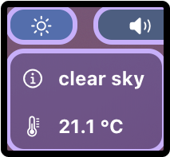
    
  </div>
  <div style="display: flex; flex-direction: row; width: 100%; align-items: start">
    The weather icon shows an icon of the current weather and has a popup with the current temperature and a weather description. All that is based on your current location.
  </div>
</div>

#### Sound

<div style="display: flex; flex-direction: column; align-items: center; border: 2px solid; border-radius: 5px; padding: 6px; background-color: #3C589F">
  <div style="display: flex; flex-direction: column; gap: 4px; margin-bottom: 15px">
    
    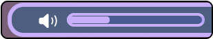
  </div>
  <div style="display: flex; flex-direction: row; width: 100%; align-items: start">
    The volume icon has a slide when you click on it which shows the current volume and you can change it by sliding the volume slider.
  </div>
</div>

#### Battery

<div style="display: flex; flex-direction: column; align-items: center; border: 2px solid; border-radius: 5px; padding: 6px; background-color: #3C589F">
  <div style="display: flex; flex-direction: column; margin-bottom: 15px; margin-top: 15px">
    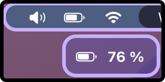
  </div>
  <div style="display: flex; flex-direction: row; width: 100%; align-items: start">
    The battery icon shows the current battery as an icon and has a popup with the current battery percentage.
  </div>
</div>

#### WLAN

<div style="display: flex; flex-direction: column; align-items: center; border: 2px solid; border-radius: 5px; padding: 6px; background-color: #3C589F">
  <div style="display: flex; flex-direction: column; margin-bottom: 15px; margin-top: 15px">
    
  </div>
  <div style="display: flex; flex-direction: row; width: 100%; align-items: start">
    The WLAN icon shows if you are connected to a network and it has internet and even has a custom symbol for the hotspot. When you click on it there is
    a popup with the current network name and the current IP address.
  </div>
</div>

#### Date and Time

<div style="display: flex; flex-direction: column; align-items: center; border: 2px solid; border-radius: 5px; padding: 6px; background-color: #3C589F">
  <div style="display: flex; flex-direction: column; margin-bottom: 15px; margin-top: 15px">
    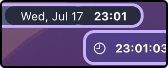
  </div>
  <div style="display: flex; flex-direction: row; width: 100%; align-items: start">
    The date and time icon shows the current date and time and has a popup with the exact time (HH:MM:SS).
  </div>
</div>

## Yabai

You can get my yabai configuration by running the following commands:

```bash
git clone https://github.com/mvritz/dotfiles.git &&
cp -r dotfiles/yabai ~/.config/yabai
```

## Skhd

You can get my skhd configuration by running the following commands:

```bash
git clone https://github.com/mvritz/dotfiles.git &&
cp -r dotfiles/skhd ~/.config/skhd
```

## Misc

### Browser

For the browser I use [Shinafox](https://github.com/Shina-SG/Shina-Fox):

<p align="center">
  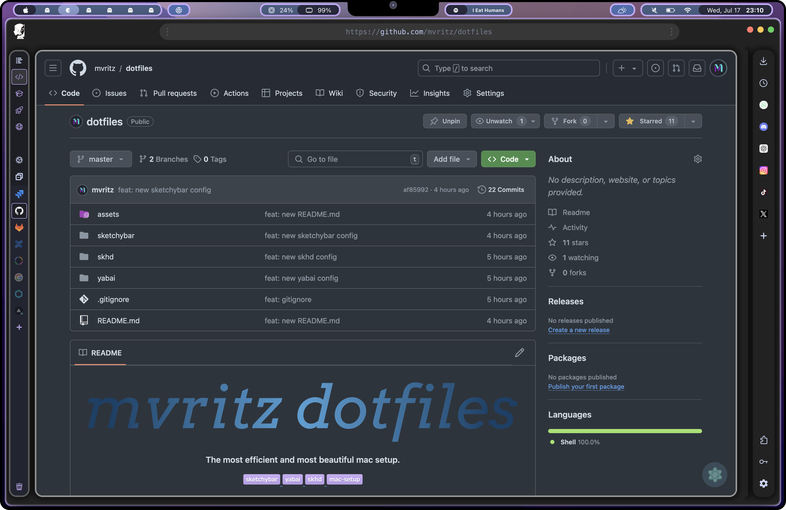
  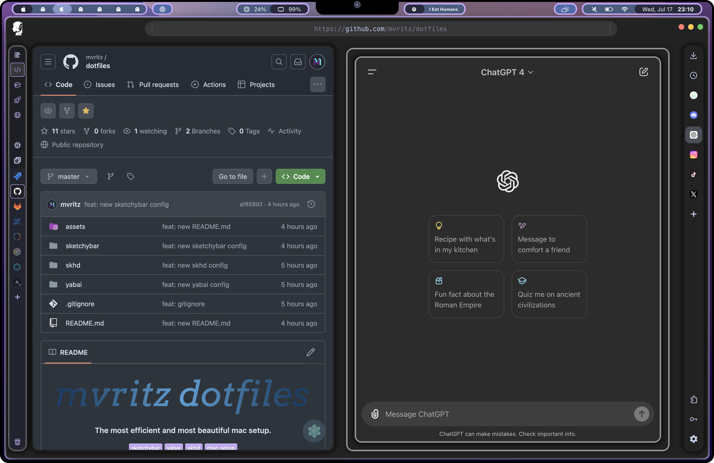
</p>

### Spicetify

For Spotify I use [Spicetify](https://spicetify.app/):

<p align="center">
  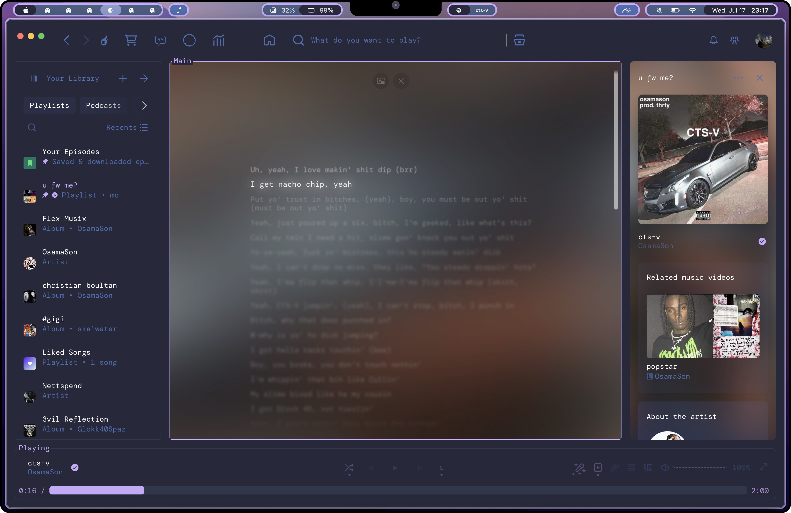
  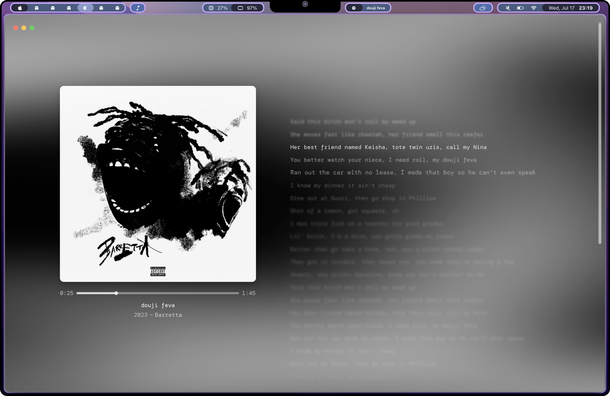
  
</p>